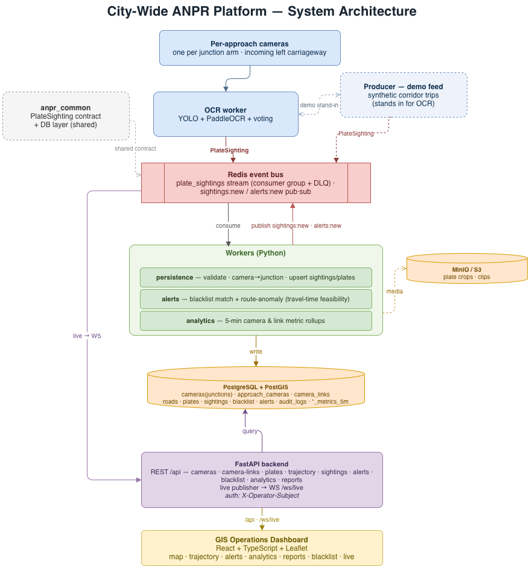

# MARG - Multi-camera ANPR & Route Graph - SIH 2026

Centralized AI platform that turns a city's existing CCTV/ANPR camera network into
one system for **plate recognition, vehicle trajectory tracking on a GIS
map, macro traffic analytics, and real-time alerts**.

## 1. Project Information

- **Project Title:** MARG - Multi-camera ANPR & Route Graph
- **PS ID:** SIH26127
- **PS Title:** City-Wide AI Engine for Multi-Camera ANPR Trajectory Tracking and Urban Traffic Analytics
- **Category:** Software
- **Theme:** Smart Automation

## 2. Problem Statement

Modern cities run vast CCTV + ANPR networks, but most systems process each feed in
an **isolated silo** - basic plate detection with no linking across space and time.
Authorities therefore cannot automatically **track a high-interest vehicle across
sectors**, and cannot extract **macro-level movement trends** from the footage the
city already collects.

## 3. Proposed Solution

A centralized platform on top of the existing camera network with four components:

1. **High-accuracy ANPR/OCR engine:** YOLO (vehicle + plate detection) + PaddleOCR
   with multi-frame voting, targeting **>90%** recognition across poor lighting,
   weather, angle, motion blur and damaged plates.
2. **Trajectory reconstruction:** query any plate and get its complete route across
   the city plotted chronologically on a GIS map, with timestamps, direction and
   camera/junction locations.
3. **Macro traffic analytics:** density heatmaps, congestion bottlenecks,
   origin-destination patterns and flow trends across all nodes.
4. **Real-time alert system:** flags **blacklisted vehicles** and **route anomalies**
   (impossible travel time / wrong direction) as they happen.

## 4. Key Features

- Per-approach ANPR cameras aggregated to junctions on a live Leaflet GIS map
- Plate search → full chronological trajectory with timestamps, direction and hops
- Live WebSocket feed of sightings + alerts
- Blacklist and route-anomaly detection (travel-time feasibility)
- Analytics: node heatmap, link congestion, origin-destination, flow trends, weekly report
- Road-accurate network (OSM junctions, OSRM-routed links)

## 5. Technology Stack

- **Frontend:** React, TypeScript, Leaflet, Vite
- **Backend:** Python, FastAPI (REST + WebSocket)
- **Workers:** Python: OCR (YOLO + PaddleOCR), persistence, alerts, analytics
- **Data & streaming:** PostgreSQL + PostGIS, Redis (streams + pub/sub), MinIO / S3
- **Geospatial:** OpenStreetMap, OSRM routing
- **Infra:** Docker Compose (uses URL-driven config, therefore swappable to managed cloud services)

## 6. Architecture



## 7. Repository Structure

```text
sih-internal-round/
├── README.md
├── SUBMISSION_GUIDE.md
├── submission/            # PRESENTATION.md, DEMO.md
├── docs/                  # architecture.md/.drawio, demo-script.md, contracts
├── assets/screenshots/    # submission screenshots
├── backend/               # FastAPI API service (REST + WebSocket)
├── workers/               # ocr, persistence, alerts, analytics, producer
├── common/anpr_common/    # shared PlateSighting contract + DB layer
├── frontend/              # React + TypeScript + Leaflet dashboard
├── db/                    # schema.sql, seed_dwarka.sql (+ generator), seed_metrics.sql
├── docker-compose.yml
├── requirements.txt
├── .gitignore
└── LICENSE
```

## 8. Final Presentation

LINK

## 9. Demo Video

LINK

## 10. Screenshots / Prototype Photos

Add key screens to **`assets/screenshots/`** — see
[assets/screenshots/README.md](assets/screenshots/README.md) for the recommended set
and naming.

## 11. Installation

```bash
git clone https://github.com/AadityaKhurana/sih-internal-round.git
cd sih-internal-round
cp .env.example .env
# Python API deps (optional — the full stack runs via Docker below):
pip install -r requirements.txt
```

## 12. Run

The whole stack runs on Docker Compose (Postgres+PostGIS, Redis, MinIO, API, the
workers, the producer, and the frontend):

```bash
docker compose up -d --build          # API :8000, dashboard :5173

# Load the genuine Dwarka demo network (the seed TRUNCATEs, so stop workers first):
docker compose stop producer persistence alerts analytics
docker compose exec -T postgres psql -U anpr -d anpr < db/seed_dwarka.sql
docker compose exec -T postgres psql -U anpr -d anpr < db/seed_metrics.sql
docker compose start producer persistence alerts analytics
```

Open the dashboard at **http://localhost:5173** and the API health at
**http://localhost:8000/health**.

> Real OCR (YOLO + PaddleOCR) needs a GPU, model weights and video, so the live
> demo drives the pipeline with a synthetic producer emitting the identical
> `PlateSighting` contract

## 13. Future Scope

- Run the real OCR engine on live RTSP/video at the edge and benchmark >90% on
  Indian plates.
- Multi-city scale-out on managed Postgres/Redis/S3; horizontal worker scaling.
- Predictive congestion and ANPR-based incident detection.

## 14. Team:

Team name: Coding_Uncles

Team Members:
- Aaditya Khurana: 2024UCS1568
- Aashna Gupta: 2024UCS1702
- Armaan Bawa: 2024UIT3317
- Bhavya Chand: 2024UCS1743
- Rasika Gautam: 2024UCM2694
- Saksham Jain: 2024UCS1632


