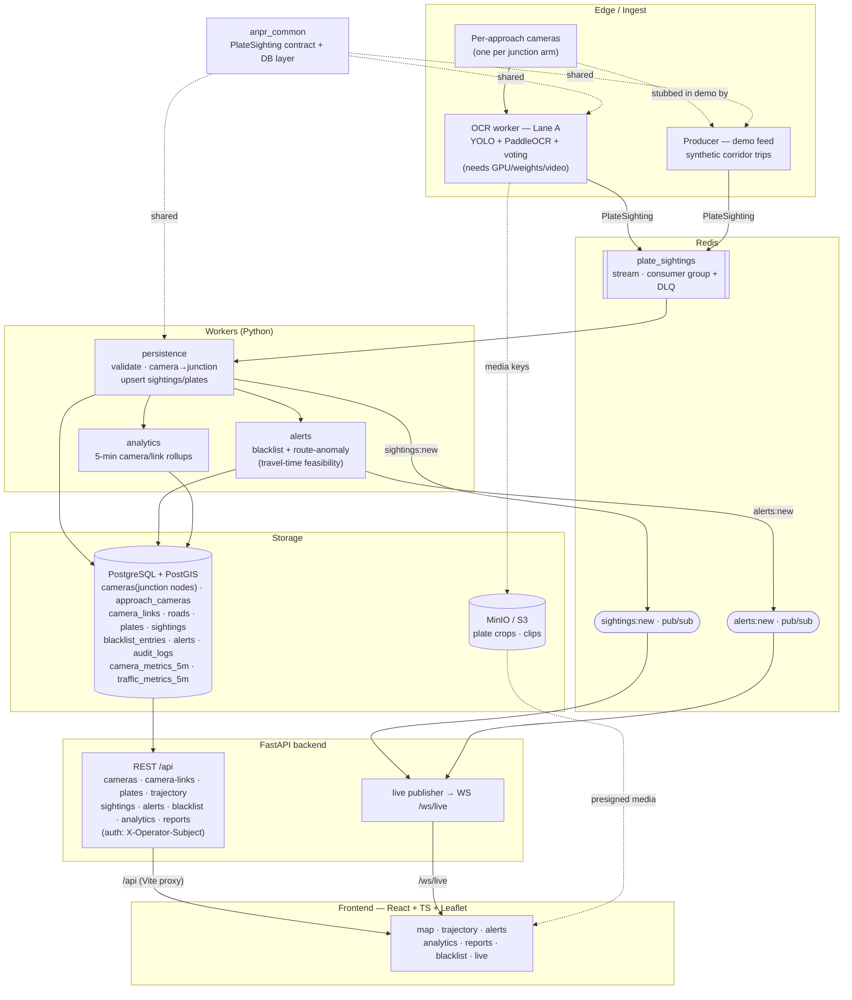

# System Architecture — City-Wide ANPR Platform

Rendered with [Mermaid](https://mermaid.js.org/) (GitHub/most viewers render it inline).

Everything integrates at the **`PlateSighting`** event boundary: the real OCR
worker (Lane A) and the demo producer are interchangeable there. Persistence
**aggregates per-approach cameras up to junction nodes**; the live path is Redis
pub/sub → the API's in-process WebSocket publisher → the dashboard.

## Runtime seams

| From | Via | To | Payload |
|---|---|---|---|
| OCR / Producer | Redis stream `plate_sightings` | persistence | `PlateSighting` (anpr_common) |
| persistence | Postgres | — | upsert `sightings` (idempotent on `source_event_id`), resolve plate, camera→junction |
| persistence | Redis `sightings:new` | API live publisher | new sighting id |
| persistence → alerts | (stream/derived) | alerts | accepted sightings |
| alerts | Redis `alerts:new` | API live publisher | new alert |
| analytics | Postgres | — | `camera_metrics_5m`, `traffic_metrics_5m` |
| API | REST `/api` + WS `/ws/live` | frontend | contract shapes in `src/types/api.ts` |

## Display model

The **map shows junctions** (the `cameras` table holds junction nodes with NULL
heading → plain circles) and **junction-to-junction links** (each junction to
every 1-edge road neighbour; a link exists only where the OSRM route passes no
other junction and is reasonably direct, bearing-hinted to avoid U-turns). The
real **per-approach cameras** live in `approach_cameras` (one per arm, on the
incoming left carriageway, facing upstream) and are the sighting data sources;
the backend aggregates their data up to junctions.

## Deployment (Docker Compose)

`postgres` (PostGIS) · `redis` · `minio` (+`minio-init`) · `api` (:8000) ·
`persistence` · `alerts` · `analytics` · `producer` · `frontend` (:5173). All
URL-driven via `.env`; swap to managed Postgres/Redis/S3 with no code changes.
