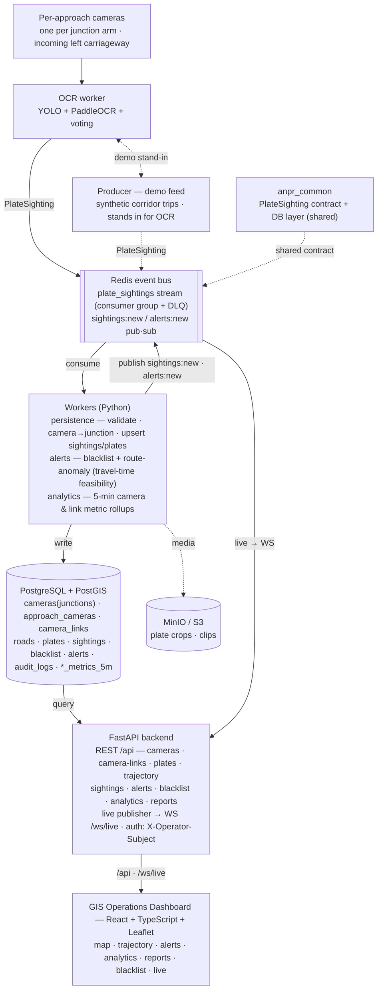

# System Architecture — City-Wide ANPR Platform

Everything integrates at the **`PlateSighting`** event boundary: the real OCR
worker (Lane A) and the demo producer are interchangeable there. Persistence
**aggregates per-approach cameras up to junction nodes**; the live path is Redis
pub/sub → the API's in-process WebSocket publisher → the dashboard.

## Runtime seams

| From | Via | To | Payload / note |
|---|---|---|---|
| OCR / Producer | Redis stream `plate_sightings` (consumer group + DLQ) | Workers (persistence) | `PlateSighting` (anpr_common) |
| Workers (persistence) | `camera→junction`, upsert | Postgres | idempotent on `source_event_id`; resolves plate + aggregates camera→junction |
| Workers | publish `sightings:new` / `alerts:new` | Redis | ids for the live feed (alerts = blacklist + route-anomaly) |
| Workers (analytics) | 5-min rollup | Postgres | `camera_metrics_5m`, `traffic_metrics_5m` |
| Redis (`sightings:new` / `alerts:new`) | live → WS | FastAPI live publisher | fanned out on `/ws/live` |
| Postgres | query | FastAPI REST `/api` | contract shapes in `src/types/api.ts` |
| FastAPI | `/api` + `/ws/live` (Vite proxy) | Frontend | REST + live |
| Workers | media (dormant) | MinIO / S3 | plate crops — provisioned; activates only with real OCR |
| `anpr_common` | shared `PlateSighting` contract + DB layer | producers · workers · API | one event schema everywhere |

## Display model

The **map shows junctions** (the `cameras` table holds junction nodes with NULL
heading → plain circles) and **junction-to-junction links** (each junction to
every 1-edge road neighbour; a link exists only where the OSRM route passes no
other junction and is reasonably direct, bearing-hinted to avoid U-turns). The
real **per-approach cameras** live in `approach_cameras` (one per arm, on the
incoming left carriageway, facing upstream) and are the sighting data sources;
the backend aggregates their data up to junctions.

## Deployment (Docker Compose)

`postgres` (PostGIS) · `redis` · `minio` (+`minio-init`) · `api` (:8000) ·
`persistence` · `alerts` · `analytics` · `producer` · `frontend` (:5173). All
URL-driven via `.env`; swap to managed Postgres/Redis/S3 with no code changes.
